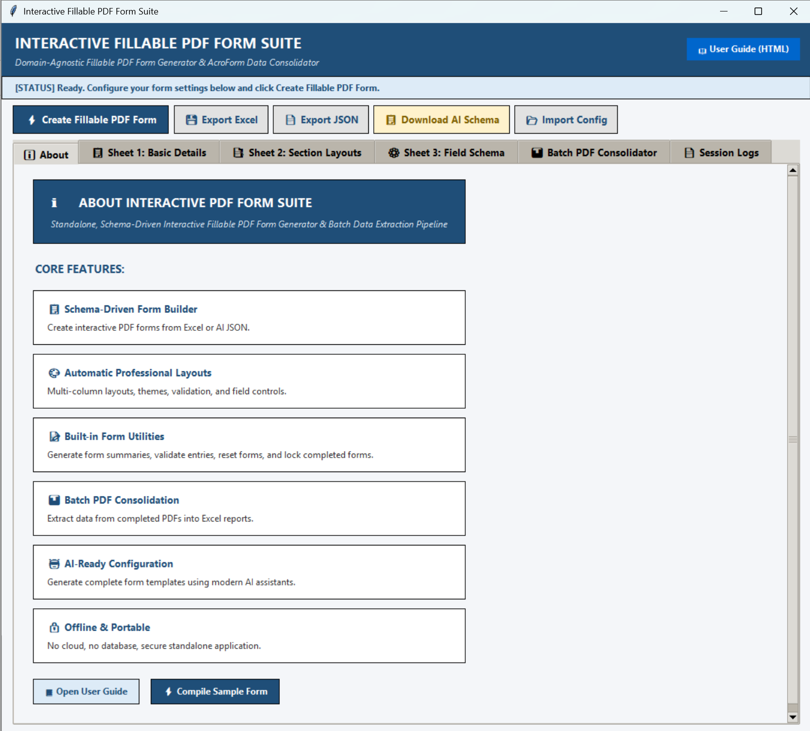
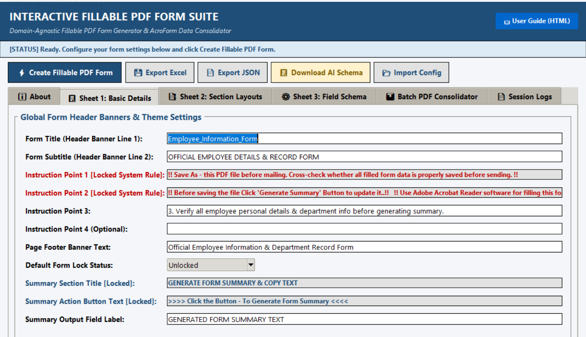
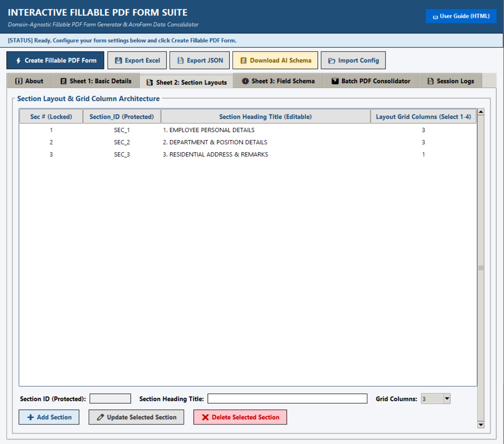
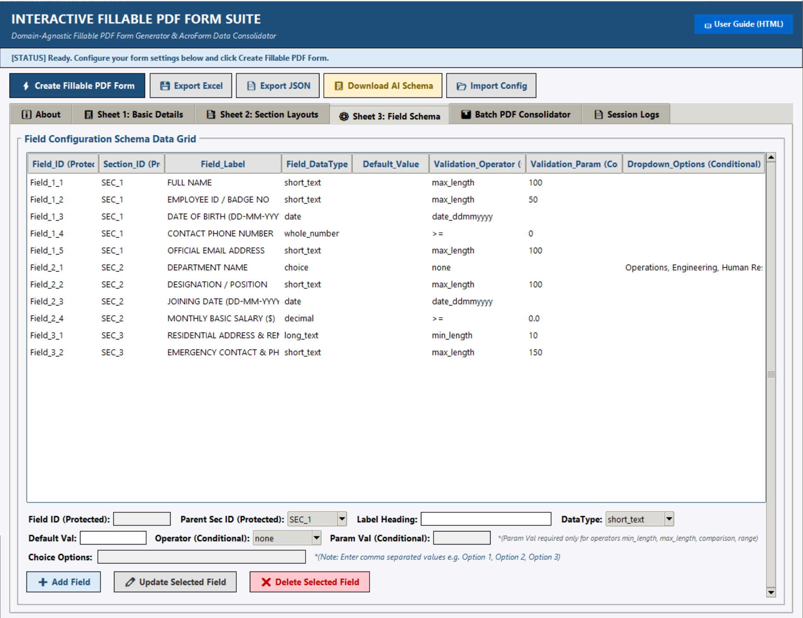
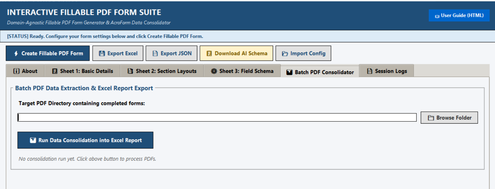

# Interactive PDF Form Suite
### *A Schema-Driven Interactive PDF Form Generator & Batch Data Extraction Engine*

---

## 📌 Executive Summary

**Interactive PDF Form Suite** is a standalone desktop platform designed for schema-driven fillable PDF form generation, live Acrobat JavaScript form runtime intelligence, and automated batch PDF data consolidation.

Unlike traditional PDF editors that require manual visual drag-and-drop field placement, **Interactive PDF Form Suite** operates on a **higher-abstraction schema model** (*Describe your form in Excel or AI JSON → Automatically generate interactive PDF forms → Fill forms → Extract & consolidate data into Excel*).

---

## 🚀 Core Features

* 📋 **Schema-Driven Form Builder:** Create interactive PDF forms entirely from simple Excel configurator workbooks or AI JSON schemas — no manual field placement.
* 🎨 **Automatic Professional Layouts:** Programmatically builds multi-column grid layouts (1 to 4 columns), validation rules, field locks, multi-line narrative boxes, and colour themes.
* 📝 **Built-in Form Utilities:** Embedded PDF automation for one-click form summary generation, field validation warnings in bright red, form resets, and interactive form locks.
* 📊 **Batch PDF Data Extraction & Consolidation:** Scans, parses, extracts, and consolidates filled PDF form data from multiple files directly back into structured Excel workbooks.
* 🤖 **AI-Ready Configuration:** Instantly generate complete form templates using modern AI assistants (LLM Prompts → JSON Schema → PDF Form).
* 🔒 **Offline, Secure & Portable:** Zero cloud dependencies, no database setup, efficient lightweight execution, and built-in standalone Windows executable.

---

## 📊 Category Feature Comparison Matrix

| Feature / Capability | Commercial Paid PDF Suites | General Open-Source Office Tools | Cloud / Web Form Builders | **Schema-Driven PDF Engine (Our Tool)** |
| :--- | :---: | :---: | :---: | :---: |
| **Cost Model** | Paid License / Subscription | Free | Freemium / Per-User Fee | **Free & Open Source (MIT)** |
| **Schema-Driven Form Builder** | ❌ | ❌ | ❌ | **✅ Yes (Excel / JSON)** |
| **Interactive AcroForm PDFs** | ✅ | ✅ | ✅ | **✅ Yes** |
| **Embedded PDF Form Automation** | Manual Scripting Required | ❌ | ❌ | **✅ Built-in / Automatic** |
| **Batch PDF → Excel Consolidation** | ❌ | ❌ | ❌ | **✅ Built-in Engine** |
| **AI-Ready Schema Integration** | ❌ | ❌ | ❌ | **✅ Built-in** |
| **Offline Standalone EXE** | ✅ | ✅ | ❌ | **✅ Built-in** |

---

## 🔄 End-to-End Closed-Loop Workflow

```text
[Describe Form Schema] (Excel / AI JSON)
        │
        ▼
[Interactive PDF Form Suite Desktop GUI]
        │
        ▼
[Interactive AcroForm PDF Form Generated]
        │
        ▼
[User Fills PDF in Adobe Reader] (Live Summary + Validation + Lock)
        │
        ▼
[Batch PDF Data Extractor Engine]
        │
        ▼
[Consolidated Excel Master Report Exported]
```

---

## 💻 Quick Start & Running the Application

### Option A: Standalone Windows Executable (No Python Required)
Run the pre-compiled standalone executable located at:
`Interactive_PDF_Generator_Suite.exe`

### Option B: Running Python Source Code (Cross-Platform)

1. **Clone Repository & Install Dependencies:**
   ```bash
   git clone <repository-url>
   cd Interactive_PDF_Generator_Suite/Interactive_PDF_Code
   pip install -r ../requirements.txt
   ```

2. **Launch Desktop GUI Application:**
   ```bash
   python gui_app.py
   ```

3. **Generate PDF Form via CLI:**
   ```bash
   python pdf_generator_from_excel.py
   ```

4. **Build Standalone .exe (Developers only):**
   ```bash
   pip install -r requirements-dev.txt
   python build_exe.py
   ```

---

## 📁 Folder Architecture

```text
Interactive_PDF_Code/
├── gui_app.py                        # Tkinter Multi-Tab Desktop GUI Configurator
├── pdf_generator_from_excel.py       # Core PDF Compiler Engine (ReportLab & AcroForm)
├── pdf_data_extractor.py             # Batch PDF Data Extraction & Excel Consolidator
├── build_pdf_configurator_excel.py   # Excel Configurator Workbook Builder
├── build_exe.py                      # PyInstaller Standalone Executable Build Script
├── fillable_pdf_configurator.xlsx    # Master Excel Form Configurator Template
├── sample_ai_form_config.json        # Sample AI JSON Schema Template
├── HELP_USER_GUIDE.html              # Built-in Interactive User Guide (HTML)
├── Interactive_PDF_Generator_Suite.exe # Pre-compiled Standalone Windows Executable
├── requirements.txt                  # Runtime dependencies (pip install)
├── requirements-dev.txt              # Developer-only dependencies (build exe)
├── screenshots/                      # Application screenshots for documentation
├── README.md                         # Suite Module Documentation & Landing Page
└── Interactive_PDF/                  # Output directory for generated PDFs & Excel reports
```

---

## 📄 Open Source Licensing

Distributed under the **MIT License**. All underlying Python libraries (`reportlab` BSD-3, `openpyxl` MIT, `pypdf` BSD-3, `Pillow` MIT-like, `PyInstaller` GPL with Bootloader Exception) are fully permissive for both personal and commercial open-source distribution.

---

## 🖥️ Supported Platforms

| Platform | Standalone EXE | Python Source |
| :--- | :---: | :---: |
| Windows 10 / 11 | ✅ Yes | ✅ Yes |
| Linux | ❌ | ✅ Yes |
| macOS | ❌ | ✅ Yes |

> **Note:** The pre-compiled `.exe` is Windows-only. All platforms can run the application from Python source after installing `requirements.txt`.

---

## 📦 Dependencies

This project relies only on mature, permissively licensed open-source libraries:

| Package | Purpose | License |
| :--- | :--- | :--- |
| `reportlab` | PDF canvas drawing & AcroForm field generation | BSD-3-Clause |
| `openpyxl` | Excel configurator read/write | MIT |
| `pypdf` | AcroForm field extraction from completed PDFs | BSD-3-Clause |
| `Pillow` | Image processing (required by ReportLab) | HPND (MIT-style) |

Developer-only (not required to run from source):

| Package | Purpose | License |
| :--- | :--- | :--- |
| `pyinstaller` | Packages application into standalone `.exe` | GPL-2.0 with Bootloader Exception |

---

## 📸 Screenshots

### ℹ️ About Tab — Core Features Overview


### 📋 Sheet 1 — Basic Form Details (Employee Information Form)


### 📑 Sheet 2 — Section Layouts & Grid Columns


### ⚙️ Sheet 3 — Field Configuration Schema


### 📊 Batch PDF Data Consolidator


---

## 📄 Changelog

See [CHANGELOG.md](CHANGELOG.md) for the full release history.

## 🤝 Contributing

See [CONTRIBUTING.md](CONTRIBUTING.md) for how to contribute, coding standards, and pull request guidelines.

## 🔒 Security

To report a security vulnerability, please see [SECURITY.md](SECURITY.md).
